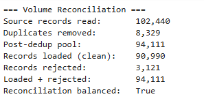
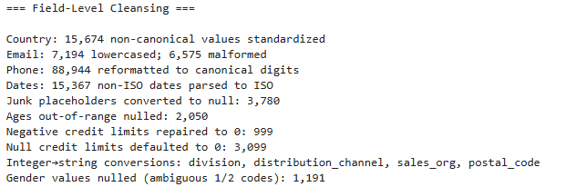
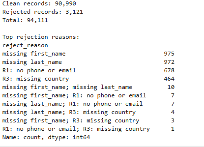

# SAP S/4HANA Customer Master Data Migration

End-to-end cleansing pipeline for a simulated SAP S/4HANA customer master migration using 102k synthetic retail records, degraded with realistic data-quality issues, processed through profiling → spec → cleansing → reconciliation. Independently designed and executed with Claude as a learning collaborator. Source data derived from the Customer Shopping Dataset (Istanbul retail, Kaggle.com), enriched with SAP-style master data fields.

## How to Run
Open notebooks/03_cleaning.ipynb → Cell → Run All to reproduce data.

## Approach

1. **Profile** develop scope of the source — quantify nulls, format inconsistencies, duplicates, out-of-range values
2. **Specify** define target fields — 23-field spec with FIX/NULL/REJECT actions and record-level conditional rules (R1–R4)
3. **Cleanse** in 8 steps — normalize whitespace, convert junk to null, standardize categoricals, repair formats, range-validate, apply defaults, deduplicate, and validate-and-split
4. **Reconcile** — volume balance, field-level counts, ground-truth comparison, and cluster analysis

## Key Design Decisions

- **Ambiguous gender codes (`1`/`2`):** nulled rather than mapped — no source documentation, risk of silent gender-flips on ~1% of records
- **Date parsing:** found 1,896 self-disambiguating dates (day > 12); these were used as evidence to defend DD/MM parsing on ambiguous numeric dates when validating `created_date`
- **Deduplication:** name + (email | tax_id | phone) fingerprint; cluster-size analysis (6,463 pairs, 405 triples, 30 quadruples, 2 quintuples), with confirmed result reflecting both injected and organic name-collision duplicates
- **R4 defaults:** conservative values where derivable/reasonable (ex. `credit_limit` defaults to 0, `payment_terms` defaults to NT00)
- **Postal codes:** data divergence from spec (no genuine UK alphanumeric postcodes present); treated uniformly as 5-digit zero-padded strings across 5 source countries

## Results




| | Count |
|---|---:|
| Source records | 102,440 |
| Duplicates removed | 8,329 |
| Records loaded | 90,990 (96.7%) |
| Records rejected | 3,121 (3.3%) |




**Field-level cleansing:**

- 15,674 country values standardized
- 88,944 phones reformatted to digits + optional `+`
- 15,367 non-ISO dates parsed to ISO across 5 format patterns
- 6,575 malformed emails nulled; 7,194 lowercased
- 3,780 junk placeholders converted to null
- 3,099 missing + 999 negative credit limits repaired to 0
- 2,050 out-of-range ages nulled
- 1,191 ambiguous gender codes nulled





**Top rejection reasons:** missing first_name (975, 31.2%), missing last_name (972, 31.1%), R1 contactability failure (678, 21.7%), R3 missing country (464, 14.9%)

## Limitations

- Mojibake/encoding repair not implemented (~1,197 records affected)
- Junk-placeholder list built from evidence in source; production version would broaden
- UK postcode handling simplified to match source-data structure

## Stack

Python, pandas, Jupyter, regex. 

## Repository
```
data/ground_truth/   reference files (not used by pipeline)
data/output/         load and reject files
data/source/         degraded source files
notebooks/           profiling, spec, cleansing, reconciliation
degradation_log.md
README.md
```